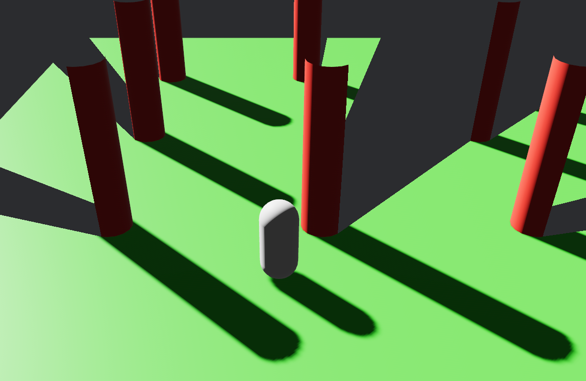

# `bevy_blackout`
`bevy_blackout` is a small shader tweak I added for a game I wanted to make, but to my surprise it turned out very modular, so I decided to publish it as a crate. The idea is that I want to discard all fragments not visible to a third-person character. This is modeled by placing a point light at your character's eye point with shadow casting enabled, then discarding all fragments that end up in "shadow" from that light's perspective. The effect supports multiple "eye-points", in which case fragments are only discarded if *no* lights can see them. This allows you to, for example, have multiple characters in the scene, and show fragments either of them can see.

To keep the effect from interfering with any of your other lights, the secret code to turn a light into a visibility marker is to set its color to black. This ensures that the marker will not affect lighting as its color will always be black at any distance, and none of your other lights will be erroneously treated as visibility markers. Only objects with `BlackoutMaterial` will be affected by the visibility culling. I also recommend enabling backface culling as otherwise you will see a lot of backfaces when meshes are between the camera and the visibility marker. Note that this is on by default for `StandardMaterial`, but if you load your meshes from a `.gltf/.glb` for example, culling may or may not be automatically enabled.

## Usage
Add `BlackoutPlugin` to your `App`:
```rs
use bevy_blackout::BlackoutPlugin;
...
app.add_plugins(BlackoutPlugin);
```
Add the material to scene objects that should be occluded:
```rs
use bevy_blackout::BlackoutMaterial;

fn setup(
    mut blackout_materials: ResMut<Assets<BlackoutMaterial>>,
    mut commands: Commands,
) {
    ...
    let player = commands.spawn(MaterialMeshBundle {
        mesh,
        material: blackout_materials.add(BlackoutMaterial {
            base: StandardMaterial {
                // Backface culling is not *necessary* but likely what you want
                cull_mode: Some(Face::Back),
                ..default()
            },
            extension: default(),
        }),
        ..default()
    }).id();
}
```
Add a visibility marker, which is just a `PointLight` with a `color` of black:
```rs
let viz_marker = commands.spawn(PointLightBundle {
    point_light: PointLight {
        color: Color::BLACK, // This light is a marker
        range: 20.0, // Most light parameters work like you'd expect
        shadows_enabled: true, // Must cast shadows or effect won't work
        ..default()
    },
    transform: Transform::from_xyz(0.0, 0.5, 0.0), // Player eye point
    ..default()
}).id();
// Add the marker to player so visibility moves around with it
commands.entity(player).add_child(viz_marker);
```
Voilà:



(The full code for this scene is the `simple` example)

Note that you will likely also want to enable backface culling for your material or else objects between the camera and the character will have their front faces discarded, and the camera will be left staring into the inverted husks of your meshes.

## Limitations
- Only works for `StandardMaterial` for now. It's a very simple effect and you can simply copy the relevant lines into your custom shader. A more permanent solution would be Bevy's core pipeline adding some kind of shader pipeline that lets you extend it at different stages, e.g. insert custom WGSL between input material params and lighting calculations
- Depending on your character's geometry, parts of the scene directly under the character may be occluded (the character can't see past his own arm for example). In the future, Bevy may allow us to exclude the character from shadow maps for a specific light. For now, the workaround is to disable shadow casting for your character entirely
- Currently only works with point lights. I'd like to see this effect with spotlights, as those could be used to "shine" visibility in a single direction rather than "radiating" it in all directions. I'll add it at some point in the future (apologies if you're reading this in the future and the last commit is >1 year ago and it's still not added)
- Limited customizability. Right now, there are ugly artifacts when a triangle is at a grazing angle to the visibility caster, so I added a threshold to automatically cull triangles at grazing angles. In the future, this (and potentially other parameters) could be tweakable

## Examples

### [`simple`](examples/simple.rs)
The visibility caster is attached to the player. Move the character around with WASD.

## Bevy Version

| bevy | bevy_blackout |
| ---- | ------------- |
| 0.12 | 0.1           |

## Contribution

PRs welcome. To be honest, I don't see this going anywhere until Bevy has a bit more robust of a render engine, but if you see a need or have a wishlist feature, feel free to implement it.
